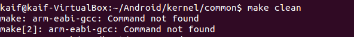

# 下载、编译、安装对应内核源代码（linux kernel）

## 下载Linux Kernel for Android源代码
### git clone
```
$ cd ~/Android
$ git clone https://android.googlesource.com/kernel/goldfish
```

### 切换分支

```
cd goldfish
git checkout remotes/origin/android-gldfish-2.6.29
cd ../
mv goldfish kernel
```

## 编译内核代码
### 导出交叉编译工具目录到$PATH环境变量中去：
```
export PATH=$PATH:~/Android/prebuilt/linux-x86/toolchain/arm-eabi-4.4.3/bin
```

### 修改common目录下的Makefile文件的以下两行为

```
# ARCH ?= (SUBARCH)
# CROSS_COMPILE ?= 
ARCH ?= arm  #体系结构为arm
CROSS_COMPILE     ?= arm-eabi- #交叉编译工具链前缀， 参考~/Android/prebuilt/linux-x86/toolchain/arm-eabi-4.4.3/bin目录 
```

### 开始编译
```
$ cd ~/Android/kernel/common
$ make clean
$ make goldfish_defconfig
$ make
```
编译成功后，可看到下面两行：
OBJCOPY arch/arm/boot/zImage
Kernel: arch/arm/boot/zImage is ready

### 可能的报错

make clean如果报arm-eabi-gcc Command not found，可能是make时无法继承PATH环境变量，尝试在编译命令前显式设置路径：
```
$ PATH=~/Android/prebuilt/linux-x86/toolchain/arm-eabi-4.4.3/bin:$PATH make clean
```
其他make命令同理。


## 在模拟器中运行编译好的内核
后台中指定内核文件启动模拟器：
```
$ emulator -kernel ./kernel/common/arch/arm/boot/zImage &
```
用adb工具连接模拟器，查看内核版本信息
```
$ adb shell # 第一次报错的话再运行一次

# cd proc
# cat version
```

从时间上可以看出是刚编译出来的内核。